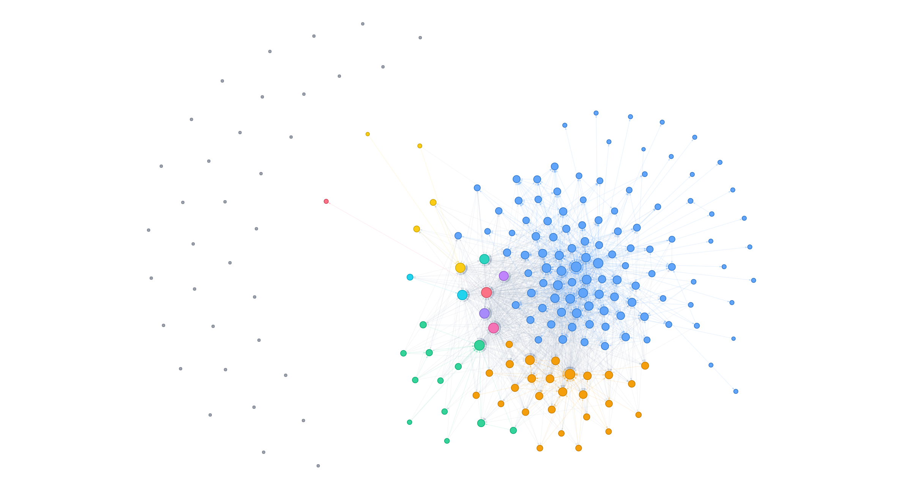

# SurveyMAE 开发文档

## 目录

- [项目概述](#项目概述)
- [快速开始](#快速开始)
- [项目架构](#项目架构)
- [配置说明](#配置说明)
- [扩展指南](#扩展指南)
- [工具集成](#工具集成)
- [测试指南](#测试指南)

---

## 项目概述

**SurveyMAE** (Survey Multi-Agent Evaluation) 是一个基于 LangGraph 的多智能体动态评测框架，专门用于评估 LLM 生成的学术综述（Survey）质量。

### 核心特性

- **多维度评估**: 4 个专业智能体从不同角度评估综述质量
- **辩论机制**: 支持多轮辩论达成共识
- **MCP 协议**: 工具可通过 MCP 协议暴露和调用
- **可扩展架构**: 易于添加新的评估维度和智能体
- **配置驱动**: 所有配置外部化，支持 YAML 管理

### 评估维度

| 智能体 | 维度 | 描述 |
|--------|------|------|
| VerifierAgent | 事实性 | 幻觉检测、引用验证 |
| ExpertAgent | 深度 | 技术准确性、逻辑连贯性 |
| ReaderAgent | 可读性 | 覆盖范围、清晰度 |
| CorrectorAgent | 平衡性 | 偏见检测、观点平衡 |

---

## 快速开始

### 前置要求

- Python 3.12+
- uv 包管理器

### 安装步骤

```bash
# 克隆项目
git clone https://github.com/your-org/SurveyMAE.git
cd SurveyMAE

# 安装依赖
uv sync

# 复制环境变量模板
cp .env.example .env

# 编辑 .env 添加 API Key
# OPENAI_API_KEY=your-key-here
```

### 运行评测

```bash
# 基本用法
uv run python -m src.main path/to/survey.pdf

# 指定输出文件
uv run python -m src.main path/to/survey.pdf -o report.md

# 使用自定义配置
uv run python -m src.main path/to/survey.pdf -c config/main.yaml

# 启用详细日志
uv run python -m src.main path/to/survey.pdf -v
```

---

## 项目架构

### 目录结构

```
SurveyMAE/
├── config/                     # 配置文件目录
│   ├── main.yaml              # 主配置（LLM、Agent、MCP服务器等）
│   └── prompts/               # Agent System Prompt 模板
│       ├── verifier.yaml
│       ├── expert.yaml
│       ├── reader.yaml
│       ├── corrector.yaml
│       └── reporter.yaml
├── src/
│   ├── main.py                # CLI 入口点
│   ├── core/                  # 核心框架层
│   │   ├── state.py           # LangGraph 状态定义
│   │   ├── config.py          # 配置加载与管理
│   │   └── mcp_client.py      # MCP 客户端封装
│   ├── agents/                # 智能体层
│   │   ├── base.py            # Agent 抽象基类
│   │   ├── verifier.py        # 事实验证智能体
│   │   ├── expert.py          # 领域专家智能体
│   │   ├── reader.py          # 读者模拟智能体
│   │   ├── corrector.py       # 偏差校正智能体
│   │   └── reporter.py        # 报告生成智能体
│   ├── graph/                 # LangGraph 图编排层
│   │   ├── builder.py         # StateGraph 构建与编译
│   │   ├── edges.py           # 条件边路由逻辑
│   │   └── nodes/             # 节点实现
│   │       ├── debate.py       # 辩论/共识节点
│   │       └── aggregator.py  # 评分聚合节点
│   └── tools/                 # 工具实现
│       ├── pdf_parser.py      # PDF 解析工具
│       ├── pdf_parser_server.py # PDF MCP Server
│       ├── citation_checker.py # 引用检查工具
│       ├── citation_checker_server.py # Citation Checker MCP Server
│       ├── citation_metadata.py # 引用元数据比较/检索
│       ├── citation_analysis.py # 引用统计分析工具
│       ├── citation_analysis_server.py # Citation Analysis MCP Server
│       ├── citation_graph_analysis.py # 引用图分析工具
│       ├── citation_graph_analysis_server.py # Citation Graph MCP Server
│       ├── literature_search.py # 文献检索聚合工具
│       ├── literature_search_server.py # Literature Search MCP Server
│       ├── result_store.py    # 结果持久化工具
│       └── fetchers/          # 各学术源适配器（arXiv/CrossRef等）
└── tests/
    ├── unit/                  # 单元测试
    └── integration/           # 集成测试
```

### 数据流

```
PDF 输入
    │
    ▼
┌─────────────┐
│ Parse PDF   │  ──→ parsed_content
└──────┬──────┘
       │
       ▼
┌──────────────────────────────────────────┐
│         并行评估阶段                      │
│  ┌─────────┐ ┌─────────┐ ┌─────────┐     │
│  │Verifier │ │ Expert  │ │ Reader  │ ... │
│  └────┬────┘ └────┬────┘ └────┬────┘     │
│       │           │           │           │
│       └───────────┴───────────┘           │
└────────────────┬───────────────────────────┘
                │
                ▼
┌──────────────────────────────────────────┐
│         辩论/共识机制                     │
│  如果评分差异 > 阈值，进入辩论阶段         │
│  多轮讨论直至达成共识或达到最大轮数       │
└────────────────┬──────────────────────────┘
                │
                ▼
┌──────────────────────────────────────────┐
│         评分聚合                         │
│  加权平均/投票产生最终评分               │
└────────────────┬──────────────────────────┘
                │
                ▼
Markdown 报告
```

---

## 配置说明

### 主配置文件 (config/main.yaml)

```yaml
# LLM 配置
llm:
  provider: "openai"           # 提供商: openai, anthropic, local
  model: "gpt-4o"             # 模型名称
  api_key: "${OPENAI_API_KEY}" # 从环境变量读取
  base_url: null              # 可选的自定义 API 地址
  temperature: 0.0            # 生成温度
  max_tokens: 4096            # 最大输出 tokens

# Agent 配置
agents:
  - name: "verifier"
    tools: ["citation_checker"]
    retry_attempts: 3
    timeout: 120
  - name: "expert"
    tools: []
    retry_attempts: 3
    timeout: 120
  - name: "reader"
    tools: []
    retry_attempts: 3
    timeout: 120
  - name: "corrector"
    tools: []
    retry_attempts: 3
    timeout: 120

# 辩论配置
debate:
  max_rounds: 3               # 最大辩论轮数
  score_threshold: 2.0         # 触发辩论的分数差异阈值
  aggregator: "weighted"       # 聚合策略: weighted, average, max
  weights:
    verifier: 1.0
    expert: 1.2
    reader: 1.0
    corrector: 0.8

# 报告配置
report:
  output_dir: "./output"
  include_evidence: true
  include_radar: true
  format: "markdown"

# MCP 服务器配置
mcp_servers:
  - name: "citation_checker"
    command: "python"
    args:
      - "-m"
      - "src.tools.citation_checker_server"
  - name: "pdf_parser"
    url: "http://localhost:8000/mcp"

# 引用抽取配置
citation:
  # backend: auto | grobid | mupdf
  backend: auto
  # GROBID 服务地址（backend 为 grobid/auto 时使用）
  grobid_url: http://localhost:8070
  grobid_timeout_s: 30
  grobid_consolidate: false
```

### 环境变量 (.env)

```bash
# OpenAI API Key
OPENAI_API_KEY=sk-your-key-here

# 可选: Anthropic API Key
ANTHROPIC_API_KEY=sk-ant-your-key-here

# 可选: API 代理
OPENAI_BASE_URL=https://api.openai.com/v1
```

### Prompt 模板 (config/prompts/)

每个 Agent 的 System Prompt 以 YAML 格式存储：

```yaml
# config/prompts/verifier.yaml
template: |
  You are {agent_name}, a fact-checking specialist reviewing the survey {section}.

  Your responsibilities:
  1. Verify factual claims against cited sources
  2. Identify potential hallucinations
  3. Check citation completeness
  4. Rate factuality (0-10)

  Evaluation criteria:
  - Citation accuracy: All claims should be supported by citations
  - No fabricated information
  - Correct reference formatting
```

---

## 扩展指南

### 添加新的评估 Agent

1. **创建 Agent 文件** (`src/agents/new_agent.py`):

```python
from src.agents.base import BaseAgent
from src.core.state import EvaluationRecord

class NewAgent(BaseAgent):
    """Description of the new agent."""

    def __init__(self, config=None, mcp=None):
        super().__init__(name="new_agent", config=config, mcp=mcp)

    async def evaluate(self, state, section_name=None) -> EvaluationRecord:
        """Perform evaluation."""
        # Your evaluation logic here
        return EvaluationRecord(
            agent_name=self.name,
            dimension="new_dimension",
            score=8.0,
            reasoning="...",
            evidence=None,
            confidence=0.8,
        )
```

2. **注册到 Workflow** (`src/graph/builder.py`):

```python
from src.agents.new_agent import NewAgent

def _create_agents(config=None):
    return [
        VerifierAgent(),
        ExpertAgent(),
        NewAgent(),  # 添加新 Agent
        ReaderAgent(),
        CorrectorAgent(),
    ]
```

3. **更新配置** (`config/main.yaml`):

```yaml
agents:
  - name: "new_agent"
    retry_attempts: 3
```

### 添加新的评估维度

1. **修改 `EvaluationRecord`** (如果需要新字段)
2. **创建对应的 Agent**
3. **更新评分聚合逻辑** (`src/graph/nodes/aggregator.py`)

### 自定义工具

#### 方式 1: 集成现有 Python 库

```python
from src.tools.pdf_parser import PDFParser

# 在 Agent 中使用
class MyAgent(BaseAgent):
    def __init__(self, config=None, mcp=None):
        super().__init__(name="my_agent", config=config, mcp=mcp)
        self.pdf_parser = PDFParser()
```

#### 方式 2: 暴露为 MCP Tool

```python
# src/tools/my_tool.py
from mcp.server import Server
from mcp.types import Tool

app = Server("my-tool")

@app.list_tools()
async def list_tools():
    return [
        Tool(
            name="my_function",
            description="Description of the function",
            inputSchema={
                "type": "object",
                "properties": {
                    "param": {"type": "string"},
                },
                "required": ["param"],
            },
        ),
    ]
```

#### 方式 3: 使用外部 MCP Server

```python
# config/main.yaml
mcp_servers:
  - name: "external_search"
    url: "http://localhost:3000/mcp"
```

然后在 Agent 中通过 `self.mcp.call_tool()` 调用：

```python
result = await self.mcp.call_tool(
    "external_search",
    "search",
    {"query": "..."}
)
```

---

## 工具集成

### PDF 解析工具

使用 `pymupdf4llm` 将 PDF 转换为 Markdown：

```python
from src.tools.pdf_parser import PDFParser

parser = PDFParser()

# 解析 PDF
content = parser.parse("paper.pdf")

# 解析并落盘（用于多 Agent 复用）
output_path = parser.parse_to_file("paper.pdf")
```

**缓存与落盘约定**
- `parse_cached()` 使用进程内缓存，按路径+mtime+size+解析参数去重。
- `parse_to_file()` 默认写入 `./output/pdf_cache`，可通过环境变量 `SURVEYMAE_PDF_CACHE_DIR` 覆盖。
- MCP 工具 `parse_pdf_to_file` 可直接落盘并返回路径。

### 引用检查工具

```python
from src.tools.citation_checker import CitationChecker

checker = CitationChecker()

# 提取所有引用
citations = checker.extract_citations(text)

# 解析参考文献列表
refs = checker.parse_reference_list(reference_text)

# 验证引用完整性
validation = checker.validate_citations(text, refs)
```

新增能力（PDF 引用解析 / 句子定位 / 参考文献关联）：

```python
checker = CitationChecker()

# 从 PDF 提取引用与参考文献（结构化）
result = checker.extract_citations_with_context_from_pdf("paper.pdf")
# result["citations"]: 每条引用包含 sentence/page/paragraph_index/line_in_paragraph
# result["references"]: 结构化参考文献列表
# result["backend"]: citations 与 references 的解析后端信息
```

MCP 工具：
- `parse_pdf_references`：返回结构化 `references` 与 `citations`
- `compare_metadata` / `verify_bib_entry`：元数据比较与联网验证
- `extract_citations_with_context`：从 PDF 抽取引用 + 句子 + 页码 + 段落内行号（可选在线校验）

**字段说明（关键）**
- `marker`: 拆分后的单个引用标记，如 `[15]`
- `marker_raw`: 原始引用串，如 `[25, 15, 26]`
- `sentence`: 引用所在句子（尽量完整）
- `page`: 页码（1-based）
- `paragraph_index`: 段落序号（按页面块合并）
- `line_in_paragraph`: 段落内行号（1-based）

### 结果持久化（ResultStore）

用于批处理与多 Agent 工作流中间结果落盘，可按论文归档：

```python
from src.tools.result_store import ResultStore
from src.tools.citation_checker import CitationChecker
from src.tools.citation_analysis import CitationAnalyzer

store = ResultStore(
    base_dir="./output/runs",
    run_id="run_001",
    tool_params={"backend": "auto", "grobid_url": "http://localhost:8070"},
)

checker = CitationChecker(result_store=store)
extraction = checker.extract_citations_with_context_from_pdf("paper.pdf")

analyzer = CitationAnalyzer(result_store=store)
summary = analyzer.analyze_pdf("paper.pdf")
```

**常用方法（示例）**
```python
paper_id = store.register_paper("paper.pdf")
store.save_extraction(paper_id, extraction)
store.save_validation(paper_id, validation)
store.save_analysis(paper_id, analysis)
store.append_error(paper_id, {"stage": "validation", "error": "timeout"})
store.append_agent_log(paper_id, {"agent": "verifier", "step": "extract", "message": "done"})
store.update_index(paper_id, status="validated", source_path="paper.pdf")
```

持久化结构（示例）：
```
output/runs/<run_id>/
  run.json
  index.json
  papers/<paper_id>/
    source.json
    extraction.json
    validation.json
    analysis.json
    errors.jsonl
```

**持久化说明**
- 默认目录为 `./output/runs`（相对项目根目录）。
- `run.json` 会记录自定义工具参数（`tool_params`），便于后续复现配置。
- `index.json` 记录每篇文献的状态与更新时间，便于批处理索引。
- 测试中若使用 `tmp_path`，结果会写入 pytest 临时目录（测试结束后自动清理）。

### 引用元数据比较工具

```python
from src.tools.citation_metadata import CitationMetadataChecker, bib_entry_from_dict

checker = CitationMetadataChecker()
bib_entry = bib_entry_from_dict({"title": "Attention Is All You Need", "year": "2017"})

# 只比较本地元数据（不联网）
comparison = checker.compare_metadata(
    bib_entry=bib_entry,
    metadata={"title": "Attention Is All You Need", "authors": ["A. Vaswani"], "year": "2017"},
    source="local"
)

# 联网检索并比较
report = await checker.verify_bib_entry(bib_entry)
```

### 引用分析工具

```python
from src.tools.citation_analysis import CitationAnalyzer
from src.tools.citation_checker import CitationChecker

analyzer = CitationAnalyzer()
checker = CitationChecker()

# 直接分析 PDF 引用统计
summary = analyzer.analyze_pdf("paper.pdf")

# 统计方法示例（需引用列表）
references = checker.extract_references_from_pdf("paper.pdf")
year_buckets = analyzer.bucket_by_year_window(references, window=5)
trend = analyzer.year_over_year_trend(references)
age_dist = analyzer.citation_age_distribution(references, paper_year=2023)
top_years = analyzer.concentration_top_years(references, top_k=3)
```

### MCP Server 启动

```bash
# 启动 Citation Checker MCP Server
uv run python -m src.tools.citation_checker_server

# 启动 PDF Parser MCP Server
uv run python -m src.tools.pdf_parser_server --port 8000
```

### GROBID（可选后端）部署

GROBID 仅在可用时参与 References 解析；不可用时自动回退到 PyMuPDF 解析。

**Docker Compose**
```bash
docker compose -f docker-compose.grobid.yaml up -d
```

**脚本启动**
- Windows PowerShell: `scripts/grobid.ps1`
- Linux/macOS Bash: `scripts/grobid.sh`

脚本内置：镜像拉取检查、自动重启、日志滚动、健康检查 `/api/isalive`。

---

## 测试指南

### 运行测试

```bash
# 运行所有测试
uv run pytest

# 运行特定测试文件
uv run pytest tests/unit/test_config.py

# 运行特定测试
uv run pytest tests/unit/test_config.py::TestSurveyMAEConfig::test_default_config

# 带详细输出
uv run pytest -v

# 生成覆盖率报告
uv run pytest --cov=src --cov-report=html
```

### 单元测试结构

```python
# tests/unit/test_<module>.py

class TestClassName:
    """测试类说明"""

    def test_method_name(self):
        """测试方法说明"""
        # Arrange
        ...
        # Act
        ...
        # Assert
        ...

    def test_method_with_params(self):
        """带参数的测试"""
        @pytest.mark.parametrize("input,expected", [
            ("input1", "result1"),
            ("input2", "result2"),
        ])
        def test_parametrized(self, input, expected):
            ...
```

### 集成测试

在 `tests/integration/` 目录下创建端到端测试：

```python
# tests/integration/test_full_workflow.py

import pytest
from src.graph.builder import create_workflow

@pytest.mark.asyncio
async def test_full_evaluation():
    """完整的评估流程测试"""
    # 准备测试数据
    ...

    # 创建工作流
    workflow = create_workflow()

    # 执行评估
    ...

    # 验证结果
    ...
```

**测试分类约定**
- `tests/unit/`: 纯逻辑、无外部依赖、无真实文件/网络。
- `tests/integration/`: 需要真实文件或联网组件。
- PDF 解析真实文件测试应放在 `tests/integration/`。
- 如需在测试中打印 PDF 引用统计，可设置 `SHOW_PDF_CITATION_STATS=1`。

**集成测试标记**
- `integration` 标记已在 `pyproject.toml` 中注册。

### 引用处理全流程测试（解析 → 校验 → 分析）

该流程验证：PDF 引用抽取 → 引用元数据校验/补全 → 引用统计分析的全链路是否可用。

**测试文件**
- `tests/integration/test_citation_grobid.py`
  - `test_grobid_reference_extraction_and_context`：抽取引用 + 句子定位 + 参考文献解析。
  - `test_citation_metadata_verification_pipeline`：校验元数据并调用 `CitationAnalyzer` 进行统计分析。

**TODO**
- 段落分布表（表2）的 Section 有时回落为父标题而非“序号 + 子章节标题”。需要改进章节识别/去重与映射逻辑，可能涉及 `src/tools/citation_checker.py` 的标题抽取与层级解析。

**运行命令（建议带 `-s` 以查看抽样输出）**
```bash
uv run pytest -s tests/integration/test_citation_grobid.py -k verification
```

**依赖说明**
- 默认只使用 `semantic_scholar` 作为校验源。
- 需配置 `SEMANTIC_SCHOLAR_API_KEY`（读取 `config/search_engines.yaml` → `.env`）。
- 校验条数由 `verify_limit` 控制（避免一次性全量访问外部 API）。
- GROBID 可用时用于参考文献解析，不可用时自动回退至 PyMuPDF。


### 代码质量检查

```bash
# 代码格式化
uv run ruff format .

# 静态分析
uv run ruff check .

# 类型检查
uv run mypy src/
```

---

## API 参考

### Core Modules

#### `src/core/state.py`

```python
class SurveyState(TypedDict):
    source_pdf_path: str           # 输入 PDF 路径
    parsed_content: str            # PDF 解析内容
    evaluations: List[EvaluationRecord]  # 评估结果
    debate_history: List[DebateMessage]  # 辩论历史
    sections: dict                 # 各章节结果
    current_round: int             # 当前辩论轮数
    consensus_reached: bool        # 是否达成共识
    final_report_md: str           # 最终报告
    metadata: dict                # 元数据

class EvaluationRecord(TypedDict):
    agent_name: str                # Agent 标识
    dimension: str                # 评估维度
    score: float                  # 评分 0-10
    reasoning: str                # 评分理由
    evidence: Optional[str]       # 支持证据
    confidence: float             # 置信度
```

#### `src/core/mcp_client.py`

```python
class MCPManager:
    async def connect(self) -> None:
        """连接所有配置的 MCP 服务器"""

    async def call_tool(self, server: str, tool: str, args: dict) -> Any:
        """调用 MCP 工具"""

    def get_langchain_tools(self, server: str = None) -> List[Dict]:
        """获取 LangChain 格式的工具定义"""
```

### Agent Base Class

```python
class BaseAgent(ABC):
    name: str                      # Agent 标识

    def __init__(self, name: str, config: AgentConfig = None, mcp: MCPManager = None):
        """初始化 Agent"""

    async def evaluate(self, state: SurveyState, section_name: str = None) -> EvaluationRecord:
        """执行评估（子类实现）"""

    async def process(self, state: SurveyState) -> dict:
        """LangGraph 节点调用方法"""
```

---

## 常见问题

### Q: 如何添加自定义的 LLM 提供商？

修改 `src/core/config.py` 中的 `LLMConfig`，然后在 `src/agents/base.py` 的 `_init_llm` 方法中添加对应逻辑。

### Q: 如何跳过辩论阶段直接聚合？

修改 `src/graph/edges.py` 中的 `should_end` 函数，强制返回 `"END"`。

### Q: 如何调试单个 Agent？

```python
from src.agents.verifier import VerifierAgent
from src.core.state import SurveyState

agent = VerifierAgent()

state = {
    "parsed_content": "...",
    "source_pdf_path": "test.pdf",
}

result = await agent.evaluate(state)
```

### Q: 如何增加辩论轮数？

在 `config/main.yaml` 中修改：

```yaml
debate:
  max_rounds: 5  # 改为 5 轮
```

---

## 贡献指南

1. Fork 项目
2. 创建功能分支 (`git checkout -b feature/my-feature`)
3. 提交更改 (`git commit -am 'Add new feature'`)
4. 推送到分支 (`git push origin feature/my-feature`)
5. 创建 Pull Request

### 代码规范

- 遵循 PEP 8
- 使用类型注解
- 添加 docstring
- 编写测试用例
- 运行代码检查 (`uv run ruff check`)

---

## 文献检索组件复用（BibGuard Fetchers）

本项目已复用 BibGuard 的检索组件（Fetcher 6 种）并封装为统一文献检索工具：

- 代码位置：`src/tools/fetchers/`（arXiv / CrossRef / Semantic Scholar / OpenAlex / DBLP / Scholar）
- 聚合接口：`src/tools/literature_search.py`
- MCP Server：`src/tools/literature_search_server.py`

### 配置与密钥管理（独立配置文件）

搜索引擎配置集中放在 `config/search_engines.yaml`，默认读取路径为：

```
config/search_engines.yaml
```

推荐使用环境变量注入密钥：

```yaml
semantic_scholar:
  api_key: ${SEMANTIC_SCHOLAR_API_KEY}

crossref:
  mailto: surveymae@example.com

openalex:
  email: ${OPENALEX_EMAIL}
```

可用环境变量：

- `SEMANTIC_SCHOLAR_API_KEY`
- `OPENALEX_EMAIL`
- `SURVEYMAE_SEARCH_CONFIG`（可覆盖配置文件路径）

禁止在仓库中提交真实 API Key。

### MCP 集成示例

在 `config/main.yaml` 中新增 MCP server：

```yaml
mcp_servers:
  - name: literature_search
    command: uv
    args:
      - run
      - python
      - -m
      - src.tools.literature_search_server
    env:
      PYTHONPATH: .
```

### 测试准则（Unit vs Integration）

- `tests/unit/`：仅测纯逻辑，不访问网络/真实文件。
- `tests/integration/`：允许真实 API / 真实 PDF 解析。
- `tests/integration/__init__.py` 会自动加载 `.env`，确保集成测试能读取密钥。
- 真实 API 测试应在未配置密钥时 `skip`，避免 CI 报错。

---

## 许可证

MIT License


---

---

## Citation Graph Addendum (2026-03)

This section summarizes the newly implemented citation-graph pipeline in this project, including graph construction, analysis, visualization, and integration testing.

### Scope

- Real citation edge construction in `src/tools/citation_checker.py`
- Metadata enrichment (including OpenAlex + Semantic Scholar references) in `src/tools/citation_metadata.py`
- Graph analytics in `src/tools/citation_graph_analysis.py`
- Visualization in `scripts/render_citation_graph_pyvis.py` and integration test export helpers
- End-to-end integration test in `tests/integration/test_citation_graph_pipeline.py`

### 1) Real Edge Construction

- Entry point: `CitationChecker.build_real_citation_edges(...)`
- Principle: only build in-set **real citation edges** from verified metadata reference lists.
- No fallback to sentence co-occurrence edges when real edges are missing.
- Persisted fields:
  - `real_citation_edges`
  - `real_citation_edge_stats`
- Failure semantics:
  - `status=failed`
  - `failure_reason=NO_REAL_EDGES`

### 2) Metadata Requirements for Edge Building

`src/tools/citation_metadata.py` now provides `reference_targets` and cross-source identifiers (e.g., `openalex_id`, semantic scholar IDs) so that references can be aligned to in-set nodes.

Supported verification sources in practice:

- `semantic_scholar`
- `openalex`

### 3) Citation Graph Analysis Output

`src/tools/citation_graph_analysis.py` consumes `references + edges` (recommended: `real_citation_edges`) and outputs the four metric groups required by the development spec:

- `density_connectivity`
- `centrality`
- `cocitation_clustering`
- `temporal`

Additional graph metadata includes node/edge counts, missing-year ratio, unresolved-edge ratio, and warnings.

### 4) Integration Test Pipeline

Primary test file:

- `tests/integration/test_citation_graph_pipeline.py`

Covered chain:

1. PDF citation parsing
2. Reference metadata verification (`semantic_scholar,openalex`)
3. Real citation edge construction
4. Citation graph analysis
5. Visualization export (`.mmd`, `.dot`, `.html`)

Implementation notes:

- The test uses real edges first and does not synthesize co-occurrence fallback edges.
- Isolated nodes are preserved in visualization exports for graph completeness.
- Validation persistence is checked to ensure new metadata/edge fields remain JSON-compatible.

### 5) Visualization

#### In test pipeline

The integration test writes preview artifacts to both temp run folders and stable exports under:

- `output/test_artifacts/citation_graph/`

#### Standalone renderer

Script:

- `scripts/render_citation_graph_pyvis.py`

Current center selection strategy for cluster coloring:

- `authority_center + elbow`
- center count is auto-selected by elbow method (not fixed top-k)

Example command:

```bash
uv run python scripts/render_citation_graph_pyvis.py   --validation .pytest_artifacts/.../validation.json   --extraction .pytest_artifacts/.../extraction.json   --output output/test_artifacts/citation_graph/test_survey2_citation_graph_preview.html
```

### 6) Environment Variables

- `GROBID_URL` (default `http://localhost:8070`)
- `CITATION_VERIFY_SOURCES` (default `semantic_scholar,openalex`)
- `CITATION_GRAPH_EXPORT_DIR` (default `output/test_artifacts/citation_graph`)

### 7) Example Graph Result (test_survey2)

Reference image file: `docs/test_survey2_citation_graph.png`



### 8) Maintenance Notes

- Keep script and integration-test visualization logic aligned:
  - `scripts/render_citation_graph_pyvis.py`
  - `tests/integration/test_citation_graph_pipeline.py`
- Keep "real-edge-first" semantics unchanged unless requirement explicitly changes.
- Future improvement TODO remains in `scripts/render_citation_graph_pyvis.py` for hybrid center selection.
